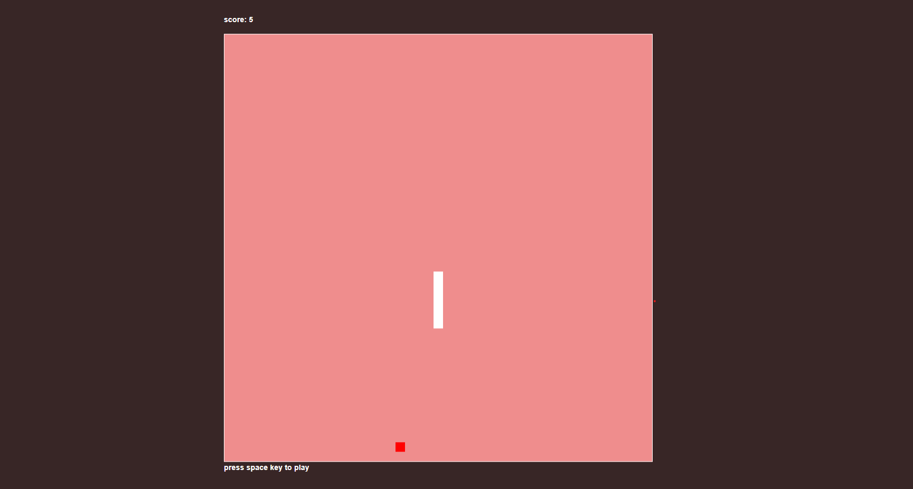

# Cold_zone_snake
This classic Snake game is developed using plain JavaScript, HTML5, and CSS. In "Cold Zone Snake," players control a snake that grows in length as it eats the food items. The goal is to navigate the snake using arrow keys, consume the food to increase your score, and avoid collisions with the walls or the snake's own body. The game includes sound effects for eating food and game over scenarios to enhance the interactive experience.

Created by Tahsin Zidane, this game demonstrates fundamental JavaScript programming concepts, including game loops, collision detection, and canvas rendering.

## game preview

 - [play game](https://tahsinzidane.github.io/Cold_zone_snake/) 

- [for mobile](https://tahsinzidane.github.io/Cold_zone_snake/mobile-version/index.html)

## Author
 - [tahsin zidane](https://github.com/tahsinzidane)

## LICENSE
this project under the mit [LICENSE](./LICENSE) 